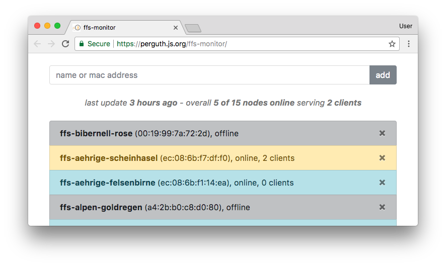

# ffs-monitor
> :crystal_ball: Monitor [freifunk-stuttgart](https://freifunk-stuttgart.de/) routers [from your browser](https://perguth.js.org/ffs-monitor/) using a [WebSocket and REST server](https://ffs-monitor.perguth.de/).

## Related

- [knotenbot](https://github.com/freifunk-darmstadt/knotenbot) `python`
- [FFNodeList](https://github.com/ffbsee/FFNodeList) `perl` Simple Freifunk Node list - based on meshviewer JSON Data and Perl.
- [Meshviewer with Grunt](https://github.com/FreifunkBremen/meshviewer-ffrgb) `javascript` Meshviewer with Grunt v1, formatted code, updated bower components, nodes.json state version (see yanic)
- [ff-monitor](https://github.com/KaterMikesch/ff-monitor) `clojure` Monitors Freifunk nodes for availability.
- [ff-mesh-metrics](https://github.com/jplatte/ff-mesh-metrics) `haskell` A small program that parses graph.json from ffmap-backend and outputs some metrics
- [FfsNodeAlarm](https://github.com/Philhil/FfsNodeAlarm/) `php` FfsNodeAlarm check online state of Freifunk Stuttgart node's. Users can select there nodes and setup a online Check-Task. 
